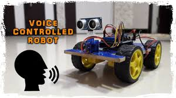
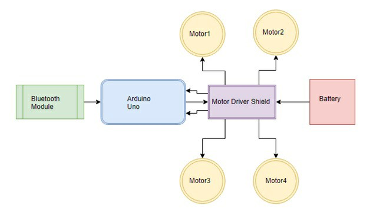
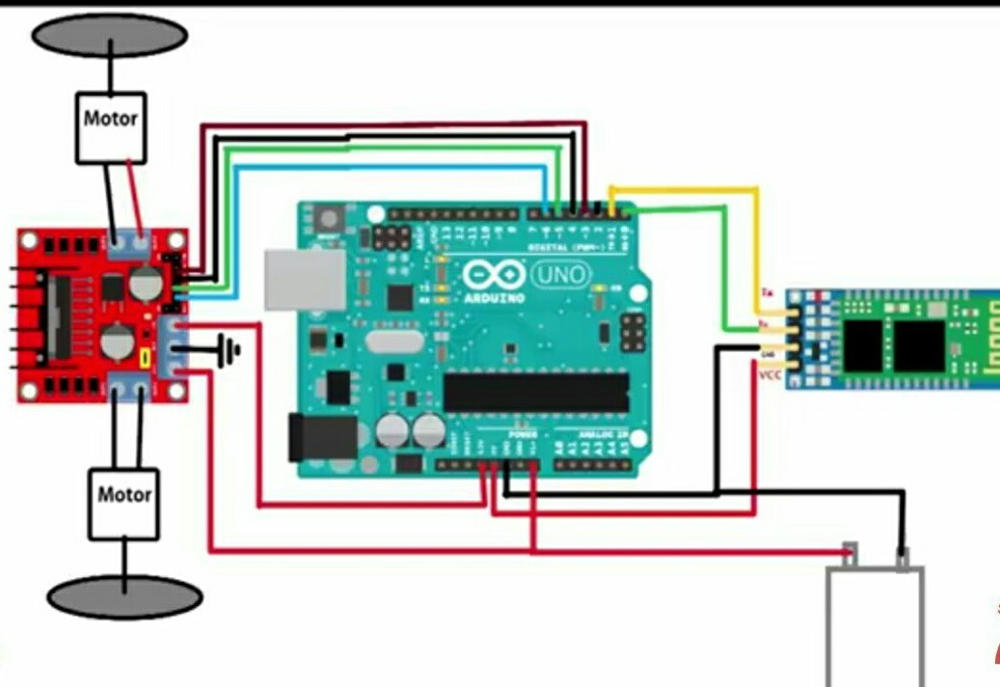
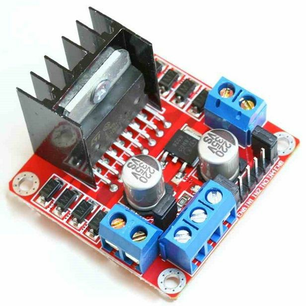
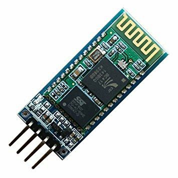
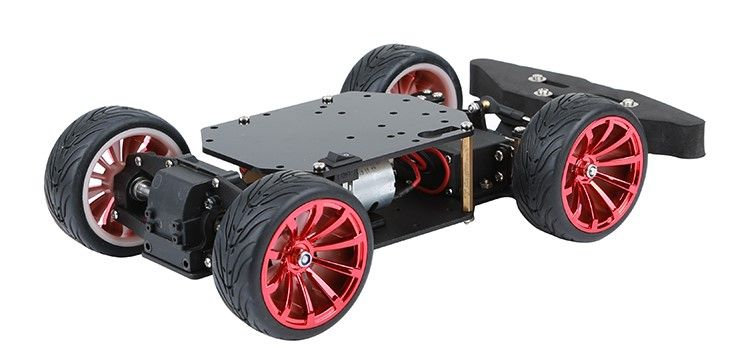
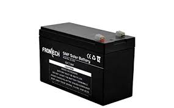
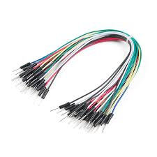

# Voice-Control-Robo-Car

- ## Project Aims

A robot is a machine especially one programmable by a computer capable of carrying out a complex series of actions automatically. Robots can be guided by an external control device or the control may be embedded within. Our intention is to bring communication and robotics into one place in the form of a voice-controlled robot. This robot can be controlled via Bluetooth module through an android app. According to the commands from the app, the robot motion can be controlled.
Trust me it's very simple to set up.The motto behind this project is to create a voice-controlled robot that could be incorporated into the things that we use in our day to day activities.

- ## What's the project?

To control and command an appliance (computer, TV, security system, etc.) by speaking to it, its efficiency is increased. Speech recognition allows the user to perform parallel tasks, (i.e. hands and eyes are busy elsewhere) while continuing to work with the computer or an appliance.

The integral part of the robot under discussion is voice control, whose basic block is Speech Recognition. Speech recognition is a technology where the system understands the words (not its meaning) given through speech.

The speech recognition circuit (SRC) we will outline, functions independently from the robot’s main intelligence (central processing unit (CPU)), thereby not consuming robot’s main CPU processing power for word recognition. The CPU must merely poll the speech circuit’s recognition lines occasionally to check if a command has been issued to the robot.

The advantage of (SRC) is its programmability. You can program and train the SRC to recognize the unique words you want recognized. The SRC can be easily interfaced to the robot’s CPU.

- ## How it work?

The figure below is basic circuit diagram for our model.

Before looking the connections, go through hardware components below.

1. First Step:HC-06 Connections
    * Connect Vcc to 5 volts.
    * Connect GND to Ground.
    * Module Tx to Rx pin of Arduino. 
    * Module Rx to Tx pin of Arduino.

2. Second Step:Motor to Motor Driver Shield
    * Left side motors to M3 and M4 terminals.
    * Right side motors to M1 and M2 terminals.
    
3. Third Step:Motor Driver to arduino board
    * First of all, mount Motor Driver shield on Arduino Uno.
    * Connect n1 pin of motor driver to Arduino 3 pin.
    * Connect n3 pin of motor driver to Arduino 4 pin.
    * Connect n4 pin of motor driver to Arduino 5 pin.
    * Connect n5 pin of motor driver to Arduino 6 pin.
    * Connect ground pin of motor driver to Arduino ground pin.
    * Finally, establish connections between Vcc of the motor and positive terminal of the battery, ground pin to negative       terminal of battery, and motor to motor driver respectively.

- ## Working

The communication between the robot and the android application is carried over by the Bluetooth link between the phone’s Bluetooth and the Bluetooth device in the Robot. The ASCII commands are sent from the phone to the Robot which in turn checked by the Arduino for the control of the wheels according to the commands to move the robot in the desired direction.

The basic idea behind the working of the robot is to create a menu driven control, i.e. the robot performs actions based on specified keywords.

For example, when the speaker gives an input like the following, the output of robot will be-

1. Forward – moves forward
2. Back – moves back
3. Right – turns right
4. Left – turns left

- ## Requirements and Details
    
  #### Software:
  
Visit https://www.arduino.cc/en/main/software for Arduino IDE (Editor to program our controller).
      
The primary stage of this project is speech to text conversion, which is achieved using an application called ‘Arduino voice control’, after being paired to the Bluetooth module.Visit https://play.google.com/store/apps/details?id=braulio.calle.bluetoothRCcontroller for the andriod application.This application will convert the speech to text and send to controller through bluetooth. This controller as per directed by the program will perform the necessary actions.
  
  #### Hardware:
  
  1. Arduino UNO
  
Arduino Uno is used because we can mount the motor driver shield in it. It is also cheap, easy to use and acquires less  space as we have to place everything on the chassis.

  2. Motor Driver L298N
  
The L298 is an integrated monolithic circuit in a 15- lead Multi watt and PowerSO20 packages. It is a high voltage, high current dual full-bridge driver designed to accept standard TTL logic levels and drive inductive loads such as relays, solenoids, DC and stepping motors.

  3. HC-06 Bluetooth Module
  
A widely available Bluetooth module that has capability to enable your project with Bluetooth. It has got one LED, which shows its state. If it is blinking that means it is not connected. If it is staying in glowing condition that means it is connected. 

  4. 4-WD Car Chassis
  
It contains 2 platforms made up of acrylic. It contains 4 dc motors with speed encoders. It is easy to assemble and provide much space to place Arduino, Bluetooth module, and batteries pack.

  5. Battery
  
Each motor used up to nearly 200mA current. Li-ion cells in parallel. The battery pack supply 12.1 volts.  Li-ion cell is a type of rechargeable battery. So we can use these cells again and again.

  6. Jumpire Wires

  

By the way these are the components I have used, you can use other hardware also which provides similar functionality.
  
- ## Applications

It is useful in places which are inaccessible to human beings, like tunnel works and highly toxic areas. It can also be used as a toy or can be incorporated into existing toys.Also the model can be optimized to implement various applicatiosn in different domains.

- ## Limitations

    * Errors in speech recognition in the presence of noise.
    * Possibility of unauthorized usage.
    
- ## References

I am ataching some of the references for the project, you can go through them.
1. https://en.wikipedia.org/wiki/Arduino#IDE
2. https://en.wikipedia.org/wiki/App_Inventor_for_Android
3. https://roboindia.com/tutorials/arduino-bluetooth-device-control-hc-06
4. https://www.sparkfun.com/datasheets/Robotics/L298_H_Bridge.pdf

## Thank you :D

  
  

